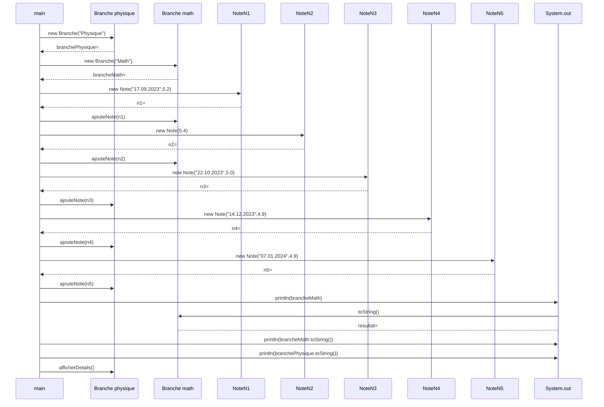

# Exercice 06 : Notes EMF
## durée : 120'
## Objectifs visés :
Maîtriser les diagrammes de séquence et devenir familier des diagrammes de classes et avec la Javadoc.

## Travail à réaliser
Lisez avec attention le diagramme de classe ci-après ainsi que la Javadoc qui est fournie afin de créer et d’implémenter le projet Java « NotesEMF ».
Vous trouverez les détails d’implémentation du main() de l’application dans le diagramme de séquence.

## Résultat à obtenir
Si votre code est correctement implémenté selon les directives reçues, vous devriez obtenir le résultat suivant sur la console :
```
Maths => 5.25 (5.20, 5.40)
Maths => 5.25 (5.20, 5.40)
Physique => 5.0 (5.00, 4.90, 4.90)
Détails de la branche : Physique
Moyenne               : 4.93
Moyenne arrondie      : 5.00
Notes effectuées      : 
 - 22.10.2023 5.00
 - 14.12.2023 4.90
 - 07.01.2024 4.90
```

### Diagramme de classes


### Structure des packages Java
Voici la structure des packages pour chaque classe du projet
```mermaid
classDiagram
namespace notesemf {
    class app
    class models
}
namespace app {
    class NotesEMF
}
namespace models {
    class Branche
    class Note 
}
```
### Diagramme de séquence
Voici le diagramme de séquence de la méthode de la méthode `main()` de la classe `NotesEMF` du package `app` :

### Javadoc
Vous pouvez cliquer sur [ce lien pour obtenir la JavaDoc en HTML](javadoc/index.html) de l'application NotesEMF.
